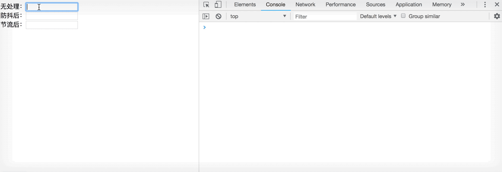
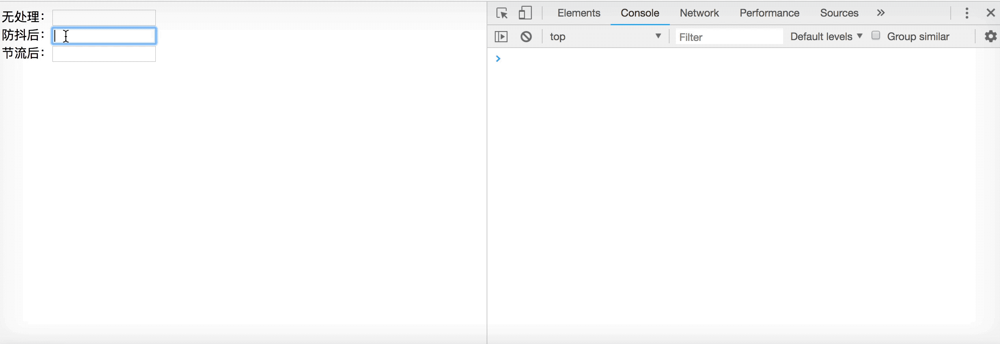
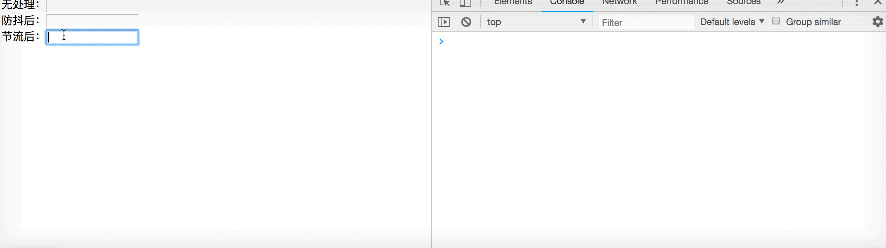

# 极简式节流与防抖

相信大家对节流和防抖这两个词都不陌生，也大概知道一点是为了减少函数的频繁执行，但对于它们的区别、实现方式以及使用场景估计有点搞不清。

今天我就用极简的白描手法带大家彻底弄清楚节流与防抖。

## 频繁执行的函数

来看个输入框的例子：

```javascript
let $input1 = document.querySelector('#input1')

function func (content) {
  console.log(content, new Date())
}

$input1.addEventListener('input', function (e) {
  func(e.target.value)
})
```



可以看到，只要按下键盘就会触发input事件，就会执行一次func函数。假如这是一个搜索框，那么用户每输入一个字符就会请求一下服务器，而且如果输入的是中文，还没等用户输入完整的拼音就会请求很多次，这无疑是非常浪费资源的。下面我们用防抖和节流解决下这个问题。

## 防抖(debounce)

> 事件停止触发n秒后再执行函数，如果在这n秒内又被触发，则重新计时。

```javascript
// 防抖：事件停止触发n秒后再执行函数，如果在这n秒内又被触发，则重新计时。
function debounce(func, delay) {
  let timer = 0
  return (...args) => { // 将函数的所有参数收敛到args数组中
    clearTimeout(timer)
    timer = setTimeout(() => {
      // 将参数全部传给func
      func(...args)
    }, delay)
  }
}

let $input2 = document.querySelector('#input2')

function func (content) {
  console.log(content, new Date())
}

let debounceFunc = debounce(func, 500)
$input2.addEventListener('input', function (e) {
  debounceFunc(e.target.value)
})
```



可以看到，用防抖函数处理后输入内容时并不会立即执行func函数，而是等用户停止输入500毫秒后再执行，如果还没过500毫秒又输入了，则会清空计时器，重新计时。

## 节流(throttle)

节流这个词怎么理解呢？举个栗子，把一个出水很大的水龙头关小，水还是会流，只是流的慢了，这就是节流了。

> 在一定时间间隔内，只执行一次函数

```javascript
// 节流：在一定时间间隔内，只执行一次函数
function throttle (func, delay) {
  let lastTime = 0 // 上一次执行函数的时间
  let timer = 0
  return (...args) => {
    let now = new Date()
    clearTimeout(timer)
    if (lastTime && now - lastTime >= delay) {
      func(...args)
      lastTime = now
    } else {
      timer = setTimeout(() => { // 保证最后一次能执行
        func(...args)
        lastTime = now
      }, delay)
    }
  }
}

let $input3 = document.querySelector('#input3')

function func (content) {
  console.log(content, new Date())
}

let throttleFunc = throttle(func, 1000)
$input3.addEventListener('input', function (e) {
  throttleFunc(e.target.value)
})
```



可以看到用节流函数处理后，每隔1s执行一次func函数，第一次和最后一次都会执行。

## 总结

- 节流与防抖都是防止函数频繁地执行，但它们的实现原理和应用场景却不一样
- 节流是固定间隔执行一次函数，防抖是将函数延迟执行

## 应用场景

把防抖和节流的原理搞明白了，什么场合下使用就非常简单了，列举几个简单的场景：

- 防抖 debounce
  - 输入框联想搜索，用防抖函数等用户停止输入再请求资源
- 节流 throttle
  - 监听resize事件，调整窗口大小执行些操作
  - 监听scroll事件