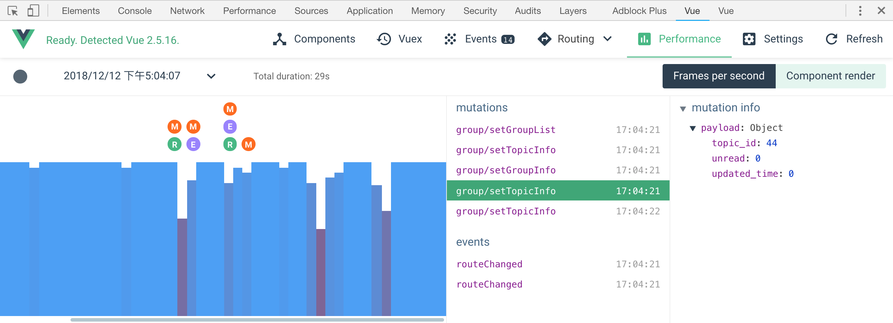
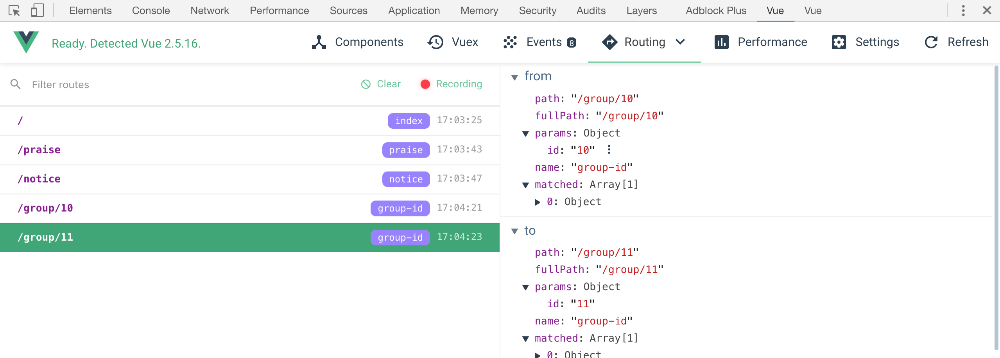
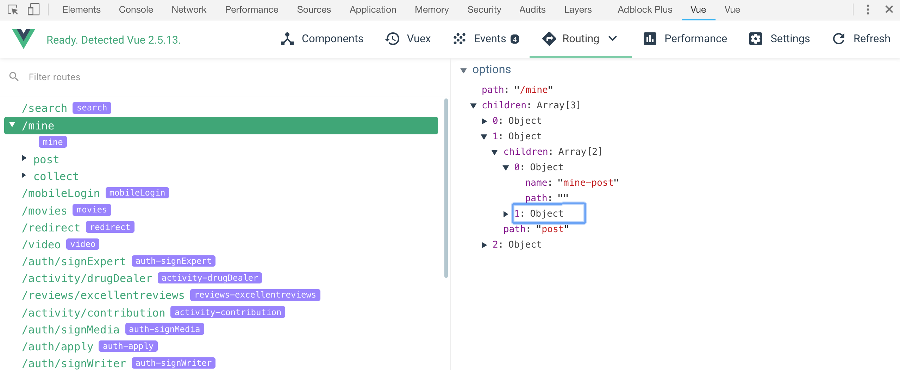
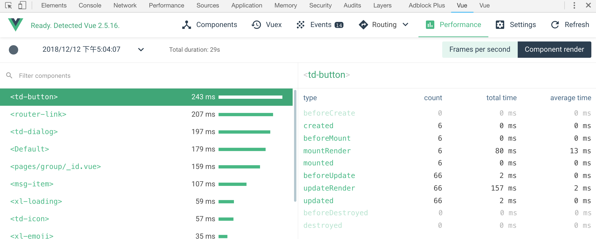
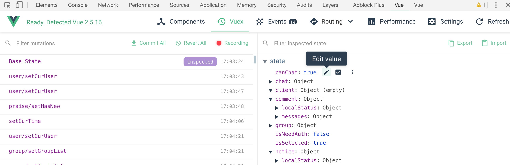
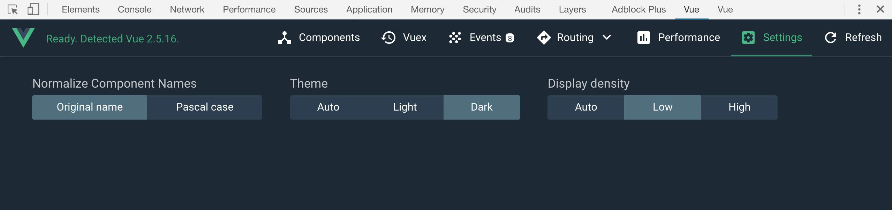
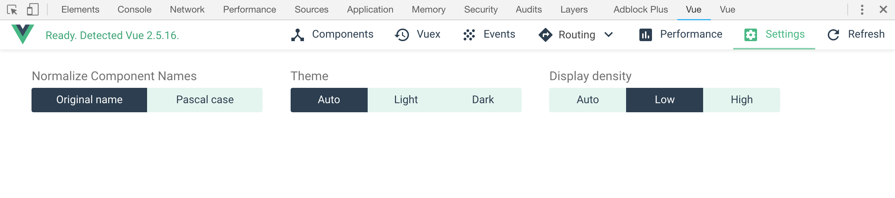

# Vue Devtool 5.0的炫酷新功能概览

Vue Devtool 近期发布了 5.0.0 beta版本，新增了一些实用炫酷的功能，增加三个面板：Routing(路由)、Performance(性能)、Settings(设置)，还有 Vuex 实时编辑功能。

## Routing(路由)

Routing面板是Vue Devtool新增的面板，有History(历史记录)和Routes(路径)两个视图，如果项目中使用了vue-router，这里可以看到详细的路由信息。

在History视图中，左侧显示了历史路由，点击其中一个路由，将在右侧显示路由变化的详细信息，这些信息包括上一个路由信息和当前路由信息，还有每个路由带的详细的参数。

在Routes视图中，左侧显示了项目中所有路由的映射信息，包括嵌套路由。点击其中一项，将在右侧显示该路由的详细参数，path、name 、children等信息。

## Performance(性能)

Performance面板也是一个全新的功能。该面板包括两部分：Frames per second (每秒帧数)和 Component render （组件渲染），默认显示的是Frames per second。

Frames per second 视图和 Chrome 开发者工具的 Performance 一样，显示的是一段时间内的性能记录，可以帮助开发者查找影响性能的一些操作或组件。

如下图，柱形图上方的“M”代表 Mutation，“E” 代表事件被触发，“R” 代表路由变化。hover到柱形图上还可以看到fps。那些下沉的厉害的柱形就是耗时最多的地方。

Component render 视图可以看到具体哪个组件耗时最多，左侧会列出组件的耗时列表，耗时最多的会排在最上面。点击其中一个组件，可以在右侧看到组件生命周期各个阶段的详细运行时间统计信息。这可以帮助开发者详细地排查性能问题。

## Vuex 实时编辑功能

Vuex 面板之前就有，这个版本新增了一个很实用的功能：在devtool中修改state。这个功能非常有用，以前我们想修改state的值，只能在代码里通过 mutation 来修改或者在代码里手动修改默认值，调试起来非常不方便。现在有了实时编辑功能，我们就可以在 devtool 中增删修改某个 state 了，大大提高了开发调试效率。

不过 Vue 不推荐非 mutation 的方式修改 state ，所以当你在 devtool 中修改时，控制台会如下报错：

> Error: [vuex] Do not mutate vuex store state outside mutation handlers.

## Settings(设置)

Settings 里可以设置组件名称样式、展示的密度、和主题

黑色主题

白色主题

[下载地址](https://chrome.google.com/webstore/detail/vuejs-devtools/ljjemllljcmogpfapbkkighbhhppjdbg)